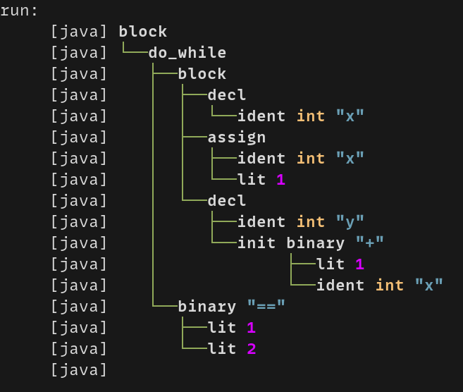

<h2> UPL </h2>
A compiler for UPL (Uet Programming Language), a custom-made programming language

Has scanner and parser (to AST) currently

<h2>Usage</h2>

To run
```sh
$ ant run
```

To run with the usage of JFlex, add `-Djflex=true`

To run with the usage of Cup, add `-Dcup=true`

To run using the bottom up version, add `-Dbottom-up=true`

(Note: `cup` overrides `bottom-up`, so if both of these are `=true` then the cup version will be used)

You can also run it with `-Dcolorful=true` for a better look (it can be broken if your terminal doesn't support it)

eg: run with cup and color `ant run -Dcup=true -Dcolorful=true`

Alternatively, you can

```sh
ant run-bottom-up
```
or
```sh
ant run-cup
```
to run bottom up and cup, respectively (also support previous arguments)

These runs will take input as file `input.upl` by default.
You can change it by adding `-Dinput=<yourfile>`, eg `ant run -Dinput=input2.upl`

Output: Parsed AST

Demo: </img>

<h2>Grammar</h2>

The (current) grammar is in [context-free-grammar.pdf](./context-free-grammar.pdf)

<h2>Main feature</h2>

- Use both top down and bottom up, with bottom up is fully automatic*
- Also use automatic parser generator Cup

Note: *With hardcoded grammar & SDT

<h2>Group member</h2>

- Nguyễn Hồng Quân (msv 22021122)

- Vũ Huy Hoàng (msv 22021108)
